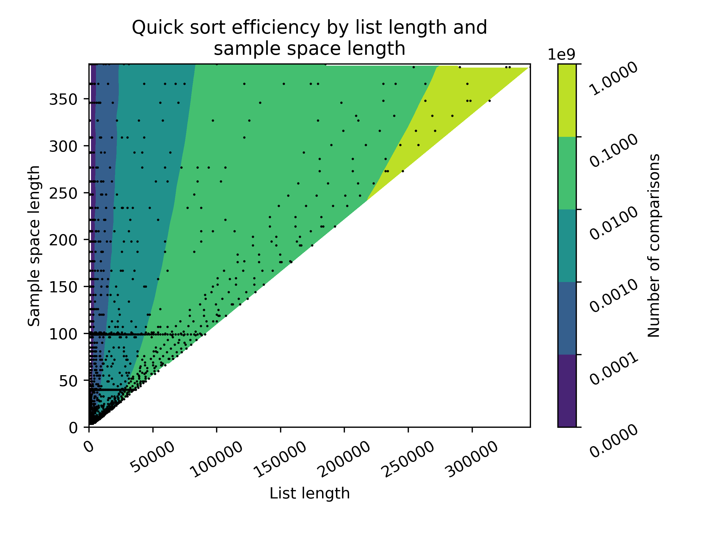

# Investigation of sorting algorithms

## Quick sort

Quick sort fails when it exceeds maximum recursion, which happens when the list is nearly sorted or there are many repeated values. 

This plot shows the boundary between where quick sort succeeds and fails, based on the list length and the sample size. The failure here is due to too many repeated values. 

The runtime is longer where as there are more repeated values, even when the quick sort eventually succeeds. 

## Radix sort

...

